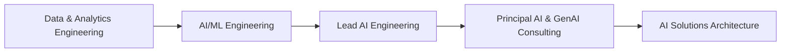

<div align="center">


### Building intelligent, secure, and production-ready enterprise AI systems

I architect AI platforms that connect **LLMs, enterprise data, autonomous agents, tools, APIs, and cloud infrastructure**—turning ambitious AI ideas into measurable business outcomes.

[](https://www.linkedin.com/in/myadav97/)
[](https://github.com/mukeshrock7897)
[](mailto:myadav.ai977@gmail.com)
[](https://github.com/mukeshrock7897)

</div>

---

## 👨‍💻 Executive Profile

```text
AI Solutions Architect
├── Generative AI & LLM Applications
├── Agentic AI & Multi-Agent Orchestration
├── RAG & Enterprise Knowledge Systems
├── Model Context Protocol (MCP)
├── Cloud-Native AI Architecture
└── AI Governance, Evaluation & Observability
```

- 🧠 **7+ years of technology experience** across AI engineering, cloud platforms, solution design, and enterprise delivery
- 🏗️ Designing **production-grade Generative AI and Agentic AI platforms** from discovery and architecture to deployment and optimization
- 🤖 Building autonomous workflows with **planning, reasoning, tool calling, memory, human approval, and feedback loops**
- 🔌 Developing **MCP servers and clients** that securely connect AI agents with enterprise data, APIs, files, and cloud services
- 📚 Creating scalable **RAG systems** with hybrid retrieval, reranking, query transformation, citations, and evaluation
- ☁️ Architecting event-driven and containerized AI solutions using **AWS, FastAPI, Docker, Kubernetes, PostgreSQL, and Redis**
- 🛡️ Engineering for **security, responsible AI, guardrails, observability, reliability, latency, and cost optimization**
- 📈 Translating complex business requirements into **AI roadmaps, reference architectures, reusable platforms, and measurable outcomes**
- 🤝 Working across engineering, product, business, compliance, and leadership teams to move AI from **prototype to production**
- 🎓 MBA in **Artificial Intelligence** | Based in **Bengaluru, India**

---

## 🎯 Core Areas of Expertise

| Domain | Capabilities |
|---|---|
| **Generative AI** | LLM application architecture, prompt engineering, structured outputs, function calling, fine-tuning strategy, multimodal AI |
| **Agentic AI** | ReAct, planning, routing, reflection, supervisor agents, multi-agent workflows, human-in-the-loop, durable execution |
| **RAG & Knowledge AI** | Ingestion, chunking, embeddings, hybrid search, metadata filtering, reranking, GraphRAG concepts, grounded generation |
| **MCP Engineering** | MCP servers, clients, tools, resources, prompts, transports, security, guardrails, enterprise integrations |
| **LLMOps & Evaluation** | Tracing, prompt/version management, RAGAS, quality evaluation, hallucination checks, latency and token-cost monitoring |
| **AI Safety & Governance** | Responsible AI, NeMo Guardrails, PII protection, prompt-injection defence, access control, auditability |
| **Cloud AI Architecture** | Microservices, event-driven systems, API design, asynchronous processing, caching, scaling, resilience |
| **AI Leadership** | Architecture strategy, stakeholder management, mentoring, technical enablement, delivery planning, solution storytelling |

---

## 🧰 Technology Arsenal

### 🤖 Generative AI, LLMs & Agents


### 🧠 Machine Learning, Deep Learning & NLP


### 🐍 Programming, APIs & Application Development


### 🔎 Vector Databases, Search & Data Platforms


### ☁️ Cloud, DevOps, MLOps & Observability


### 🛡️ Quality, Evaluation & Guardrails


---

## 🏗️ What I Build

| Solution | Architecture Focus | Business Value |
|---|---|---|
| **Enterprise AI Assistants** | RAG, memory, citations, access control, evaluation | Faster knowledge discovery and decision support |
| **Autonomous Agent Systems** | Planning, tools, routing, multi-agent collaboration, approvals | Workflow automation with controlled autonomy |
| **MCP Integration Platforms** | Standard tools, resources, prompts, APIs, security | Reusable connections between agents and enterprise systems |
| **AI Engineering Platforms** | Templates, gateways, caching, tracing, evaluation, guardrails | Faster and safer AI product delivery |
| **Cloud Cost Intelligence** | Cost ingestion, natural-language analytics, trends, charts | Improved visibility and cloud-cost optimization |
| **AI Observability Platforms** | Logs, traces, metrics, quality and drift monitoring | Reliable production operations and faster diagnosis |
| **Risk & Finance AI** | Forecasting, scenario generation, anomaly detection, explainability | Better risk insights and operational resilience |

---

## 🚀 Featured Engineering Work

<table>
<tr>
<td width="50%" valign="top">

### 🤖 Zora Agent

Agentic learning and career assistant featuring:

- Goal and skill planning
- Adaptive MCQ assessments
- User memory and progress tracking
- Tool-driven workflows
- Guardrails and confirmations
- Secure authentication and file context

</td>
<td width="50%" valign="top">

### 📊 CostBot & CostMCP

Conversational cloud-cost intelligence platform featuring:

- LangGraph orchestration
- Remote MCP tools
- Natural-language cost analysis
- Trends, summaries, and charts
- Redis caching and chat history
- AWS and Snowflake cost insights

</td>
</tr>
<tr>
<td width="50%" valign="top">

### 🔌 Enterprise MCP Starter

Production-oriented MCP foundation featuring:

- Docker-first development
- Clean tool and configuration layers
- Guardrails and structured errors
- Testing and extensibility
- Clone, run, and customize workflow
- Enterprise-ready engineering conventions

</td>
<td width="50%" valign="top">

### 🧠 Enterprise Knowledge Assistant

Secure knowledge intelligence platform featuring:

- Hybrid document retrieval
- Query rewriting and reranking
- Multi-agent tool orchestration
- Citations and grounded responses
- Evaluation and prompt tracing
- Access control and auditability

</td>
</tr>
</table>

---

## 💼 Professional Journey



My professional evolution spans **data engineering, machine learning, NLP, cloud platforms, Generative AI, Agentic AI, enterprise architecture, and technical leadership**. Today, I focus on building reusable AI capabilities and guiding teams toward secure, observable, and production-ready implementations.

---

## 🧭 Architecture & Leadership Strengths

- **AI Strategy:** Use-case discovery, feasibility assessment, architecture roadmaps, platform strategy, and KPI alignment
- **Solution Architecture:** Reference architectures, C4 diagrams, ADRs, sequence flows, integration design, and non-functional requirements
- **Product Thinking:** Problem framing, prioritization, pilots, measurable outcomes, and prototype-to-production planning
- **Engineering Leadership:** Mentoring, design reviews, standards, reusable templates, delivery governance, and technical enablement
- **Stakeholder Management:** Translating AI complexity into clear business narratives, demonstrations, trade-offs, and decisions
- **Production Excellence:** Scalability, security, resilience, evaluation, observability, performance, and cost optimization

---

## 🏅 Learning & Certifications

- 🎓 **MBA in Artificial Intelligence**
- 📜 AI in Production: GenAI and Agentic AI at Scale
- 📜 Software Architecture & Design of Modern Large-Scale Systems
- 📜 AI for Business Leaders
- 📜 Product Management for AI
- 📜 Product Management & Product Design with Generative AI
- 📜 AI for Product Management & Innovation
- 📜 Generative AI Application Design and Development

---

## 📊 GitHub Intelligence

<div align="center">


<br />


<br />


<br />


</div>

---

## 🌱 Currently Exploring

- Advanced multi-agent collaboration and durable execution
- Enterprise MCP security, governance, and standardization
- Small language models and self-hosted open-source LLMs
- Agent and RAG evaluation at production scale
- AI engineering productivity and autonomous development workflows
- Cost-efficient inference, semantic caching, and LLM routing

---

## 🤝 Let's Build the Future of Enterprise AI

I'm open to meaningful conversations and collaboration around:

`Generative AI` · `Agentic AI` · `MCP` · `RAG` · `LLM Platforms` · `AI Architecture` · `Cloud-Native AI` · `AI Leadership`

<div align="center">

[](https://www.linkedin.com/in/myadav97/)
[](https://github.com/mukeshrock7897)
[](mailto:myadav.ai977@gmail.com)

### “The real value of AI begins when intelligence becomes reliable, scalable, and useful.”


</div>
